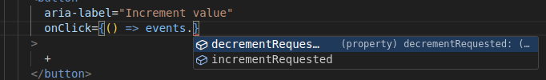
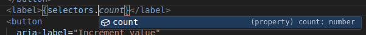

# Basic Counter Example

A minimal demonstration of the Softer Components architecture showing how to create a state-manager-agnostic component with Redux integration.

## Overview

This example showcases the core principles of Softer Components:

- **Pure component definition** - Business logic separated from UI framework
- **Type safety** - Full TypeScript support with strict mode
- **State-manager agnostic** - Component definition works with any state manager
- **One slice per component** - Clean separation of concerns

## Architecture

### Component Definition (`counter.component.ts`)

The component definition contains all business logic and state management without any framework dependencies: [counter.component.ts](src/components/counter/counter.component.ts)


### UI Component (`Counter.tsx`)

The React component contains only presentation logic, retrieving typed event dispatchers and selectors:
[Counter.tsx](./src/components/counter/Counter.tsx)

#### event dispatchers


#### selectors



## Key Benefits

### 🎯 **Pure Business Logic**
- Component definition has zero dependencies on React or Redux
- Testable without UI framework
- Reusable across different state managers

### 🔒 **Type Safety**
- Full TypeScript inference from component definition
- No manual typing of selectors or event handlers
- Compile-time validation of state updates

### 🔄 **State-Manager Agnostic**
- Same component definition works with Redux, Zustand, or any other state manager
- Easy migration between state management solutions
- Framework-independent component testing

### 🏗️ **Clean Architecture**
- One Redux slice per UI component
- Clear separation between business logic and presentation
- Predictable component structure

## Running the Example

Following the Softer Components development workflow:

```bash
# Navigate to the example
cd /home/ben/dev/repositories/softer-components/packages/examples/basic-example-counter

# Install dependencies
pnpm install

# Development server
pnpm dev

# Run tests - takes ~1.5 seconds
pnpm test

```

## File Structure

```
basic-example-counter/
├── src/
│   ├── components/
│   │   └── counter/
│   │       ├── counter.component.ts    # Pure component definition
│   │       └── Counter.tsx             # React UI component
│   ├── store.ts                        # Redux store configuration
│   ├── App.tsx                         # Root application component
│   └── main.tsx                        # Application entry point
├── package.json
├── tsconfig.json
└── README.md
```

## Testing

The component definition can be tested independently of React:

```typescript
import { counterComponentDef } from "./counter.component";

describe("Counter Component", () => {
  it("should increment count", () => {
    // GIVEN initial state
    const state = counterComponentDef.initialState;
    
    // WHEN increment action is applied
    const newState = counterComponentDef.stateUpdaters.increment(state);
    
    // THEN count should be incremented
    expect(newState.count).toBe(1);
  });
});
```

## Next Steps

- See [redux-adapter example](../basic-redux-with-softer-components/) for more complex scenarios
- Explore [component composition patterns](../../docs/component-composition.md)
- Learn about [event forwarding](../../docs/event-forwarding.md) between components

## Related Examples

- **[Redux Integration](../basic-redux-with-softer-components/)** - Full Redux Toolkit integration
- **[Component Dependencies](../component-dependencies/)** - Inter-component communication
- **[Async Effects](../async-effects/)** - Handling side effects and API calls