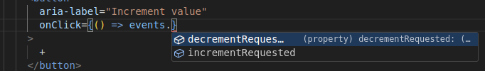
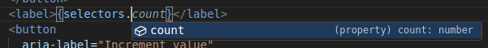

# Basic Counter Example

A minimal demonstration of the Softer Components architecture showing how to create a state-manager-agnostic component with Redux integration.

## Overview

This example showcases the core principles of Softer Components:

- **Pure component definition** - Business logic separated from UI framework
- **Type safety** - Full TypeScript support with strict mode
- ** Platform and state-manager agnostic** - Component definition is completely decoupled from React and Redux.

## Architecture

### Component Definition (`counter.component.ts`)

The component definition contains all business logic and state management without any framework dependencies: [counter.component.ts](src/components/counter/counter.component.ts)

### UI Component (`Counter.tsx`)

The React component contains only presentation logic, retrieving typed event dispatchers and selectors:
[Counter.tsx](./src/components/counter/Counter.tsx)

#### event dispatchers



#### selectors



## Key Benefits

### 🎯 **Pure Business Logic**

- Component definition has zero dependencies on React or Redux (it is in fact identical to the angular NgRx example)
- Testable without any UI framework

### 🔒 **Type Safety**

- Full TypeScript inference from component definition
- No manual typing of selectors or event handlers
- Compile-time validation of state updates

### 🔄 **State-Manager Agnostic**

- Keep your business logic safe from evolutions of external libraries and frameworks
- Framework-independent component testing

### 🏗️ **Strict Architecture**

- Clear separation between business logic and presentation
- Predictable component structure


### Testing

The component definition can be tested independently of React:

## Running the Example

```bash
# install the dependencies
pnpm install

# Development server
pnpm dev
```

## File Structure

```
basic-example-counter/
├── src/
│   ├── components/
│   │   └── counter/
│   │       ├── counter.component.test.ts    # Platform agnostic tests
│   │       ├── counter.component.ts    # Pure component definition
│   │       └── Counter.tsx             # React UI component
│   ├── store.ts                        # Redux store configuration
│   ├── App.tsx                         # Root application component
│   └── main.tsx                        # Application entry point
├── package.json
├── tsconfig.json
└── README.md
```

