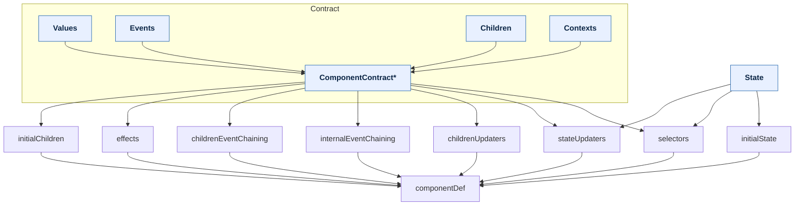

# Softer Components Types

## Types for Applications

As a developer using `@softer-component`, you main job is to create your own `ComponentDef` which includes the following parts:
 1. `initialState`: initial state of the component
 2. `allEvents`: the names of all the events that the component can emit (TO BE REMOVED in issue [#69](https://github.com/BenLayet/softer-components/issues/69))
 3. `uiEvents`: the names of the events that can be triggered by the UI
 4. `selectors`: that creates 'values' from its own state, and its children and contexts state.
 5. `stateUpdaters`: that generate a new component state from the current state and the event data
 6. `eventForwarders`: that forward events from the component to its parent or to its children
 7. `effects`: that defines the side effects of the component, and which events trigger them
 8. `initialChildrenInstances`: that defines the initial children of the component
 9. `childrenUpdaters`: that adds or removes children after an event
 10. `childrenConfig` and `contextsConfig`: that defines the event chaining between the component and its children
 11. `childrenComponentDefs` and `contextComponentDefs`: that defines the specific definitions of the children and contexts

The `ComponentDef` type depends on the `ComponentContract` type and `State` type:
 - The `ComponentContract` keeps the internal parts of the component consistent with each other, and exposes the contract of the component to the outside world
 - The `State` also keeps parts consistent with each other but is not exposed to the outside world.

### Internal Dependencies

### Recommended File Structure
To avoid duplication of code, it is actually simpler to derive:
 - `State` from the `initialState` 
 - `Values` from the `selectors`
 - `Events` from the `allEvents` and `uiEvents`.

For example, you can have the following files for a component called `MyComponent`:

1. `my-component.events.ts` - where you define the events that your component can emit, and the types of data that are associated with those events, and which one can be triggered by the UI.
2. `my-component.state.ts` - where you define the initial state of your component and expose the `State` type.
3. `my-component.children.ts` - where you define the types of children that your component needs
   - can use **external** children contracts or define them here 
4. `my-component.contexts.ts` - where you define the types of children that your component needs
    - can use **external** contexts contracts or define them here
5. `my-component.selectors.ts` - where you define the selectors of your component, and expose the `ValuesContract` type that defines the values that the component exposes to its children and to the outside world.
   - that depends on `my-component.state.ts`, `my-component.children.ts` and `my-component.contexts.ts``
6. `my-component.contract.ts` - compiles the `Values`, `Event`, `Children` and `Contexts`  contracts into a single `ComponentContract` type.
    - depends on `my-component.events.ts`, `my-component.selectors.ts`, `my-component.children.ts` and `my-component.contexts.ts`
7. `my-component.updaters.ts` - for state and children updaters
    - depends on `my-component.contract.ts` and `my-component.state.ts`
8. `my-component.effects.ts` - for the effects of the component
    - depends on `my-component.contract.ts` and typically on **external** services interfaces
9. `my-component.config.ts` - where you define the `ComponentDef` of your component, by compiling all the previous parts together.
   - depends on all the previous files, and on **external** children and contexts component def.
   - typically this is a factory that receives the implementation of effect services as a parameter
